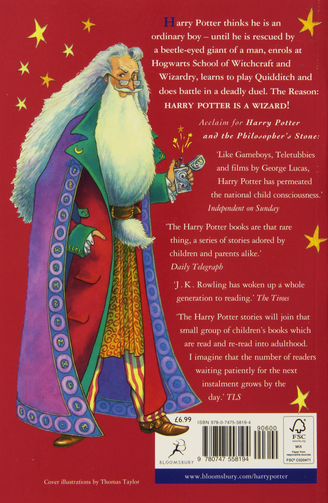

| [Home](README.md) | [Research](research.md) | [Talks](talks.md) | [Teaching](teaching.md) | [Hobbies](hobbies.md) |
| --- | --- | --- | --- | --- |

# Albus Dumbledore

Hello, I am a professor at [Hogwarts Schoold of Witchcraft and Wizardy](https://hogwarts.uk). I did my PhD at the same institute under Prof. Godric Gryffindor, and my specialization is the art of wand-duelling and philosophy. Besides I have served as the Head of Gryffindor House for 10 years, and have collaborated with Gregorovitch and Grindenwald.

In case you are interested to work with me, or ask me anything, please drop an email at albus@hogwarts.uk. Yes, and [this](files/albus_CV.pdf) is my CV.
