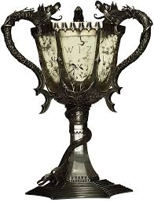

| [Home](README.md) | [Research](research.md) | [Talks](talks.md) | [Teaching](teaching.md) | [Hobbies](hobbies.md) |
| --- | --- | --- | --- | --- |

## My Papers

> Albus Dumbledore and Severus Snape, *The wierd way patronii work*, Journal of British Dementor Control (2017).

> Albus Dumbledore and Minerva McGonagall, *Cats and Witches*, Journal of Ethical Transformation (2010). [[preprint]](https://warxiv.org/cats.pdf)

### Find me on:

|  |  |  |
| --- | --- | --- |
